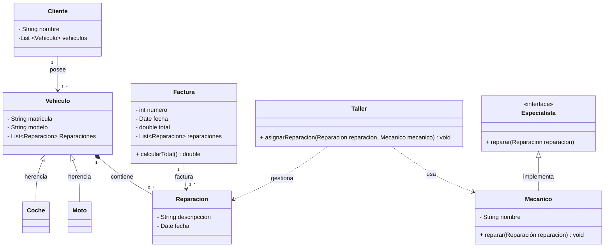

# 6.3 Actividad Taller: Diseño de Arquitectura de Software

```mermaid
classDiagram
    class Vehiculo {
        - String matricula
        - String modelo
        - List~Reparacion~ Reparaciones
    }
    class Coche {

    }
    
    class Moto{

    }

    class Cliente {
        - String nombre
        -List ~Vehiculo~ vehiculos
    }

    class Reparacion {
        - String descripccion
        - Date fecha
    }

    class Especialista {
        <<interface>>
        + reparar (Reparacion reparacion)
    }

    class Mecanico {
        - String nombre
        + reparar (Reparación reparacion) void
    }

    class Taller {
        + asignarReparacion (Reparacion reparacion, Mecanico mecanico) void
    }

    class Factura {
        - int numero
        - Date fecha
        - double total
        - List~Reparacion~ reparaciones
        + calcularTotal() double
    }

    %% HERENCIA
    Vehiculo <|-- Coche : herencia
    Vehiculo <|-- Moto : herencia

    %% COMPOSICION (vinculo fuerte)
    Vehiculo "1" *-- "0..*" Reparacion : contiene

    %% ASOCIACION
    Cliente "1" --> "1..*" Vehiculo : posee

    %% ASOCIACION
    Factura "1" --> "1..*" Reparacion : factura

    %% DEPENDENCIA
    Taller ..> Mecanico :usa
    Taller ..> Reparacion : gestiona

    %% REALIZACION (interfaz)
    Especialista <|-- Mecanico : implementa

```
