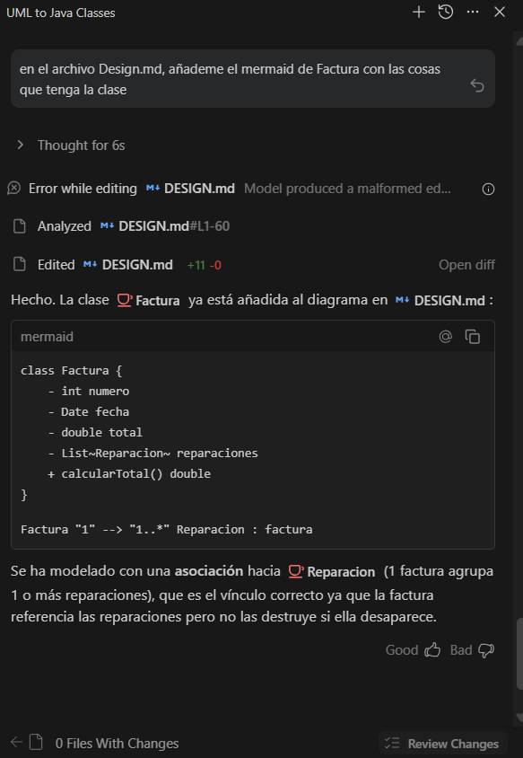
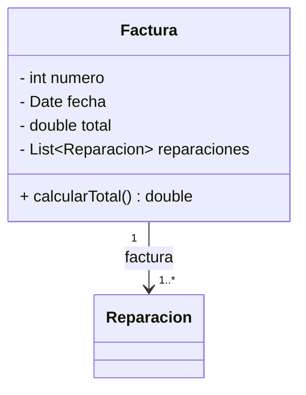

# 6.3 Actividad Taller: MerceDAWs

Proyecto de diseño e implementación de una arquitectura software orientada a objetos para la gestión de un taller mecánico. Se ha aplicado el ciclo completo: diseño UML → implementación en Java → interpretación → ingeniería inversa.

---

## FASE 1: Diseño de Arquitectura de Software

Se ha diseñado la arquitectura del sistema mediante un **diagrama de clases UML** en notación Mermaid, recogiendo las siguientes relaciones:

| Relación | Entre |
|---|---|
| Herencia | `Vehiculo` → `Coche`, `Moto` |
| Composición | `Vehiculo` ◆── `Reparacion` |
| Asociación | `Cliente` ──▶ `Vehiculo` |
| Realización | `Especialista` ◁── `Mecanico` |
| Dependencia | `Taller` ──▶ `Mecanico`, `Reparacion` |

[Ver diagrama completo en DESIGN.md](DESIGN.md)

---

## FASE 2: Implementación de la Arquitectura

Se han implementado en Java todas las clases del diagrama UML:

| Clase | Tipo | Descripción |
|---|---|---|
| `Especialista` | `interface` | Contrato para cualquier especialista que repare |
| `Reparacion` | Clase | Representa una reparación con descripción y fecha |
| `Vehiculo` | Clase abstracta | Base común para `Coche` y `Moto` |
| `Coche` | Clase | Vehículo de tipo coche |
| `Moto` | Clase | Vehículo de tipo moto |
| `Cliente` | Clase | Cliente con lista de vehículos asociados |
| `Mecanico` | Clase | Implementa `Especialista`, realiza reparaciones |
| `Taller` | Clase | Asigna reparaciones a mecánicos |

[Ver implementación en ActividadTaller/src/main](ActividadTaller/src/main)

---

## FASE 3: Interpretación de la Arquitectura

### ¿Por qué composición y no agregación entre `Vehiculo` y `Reparacion`?

Se ha elegido **composición fuerte** porque una `Reparacion` no tiene sentido de forma independiente: pertenece a un `Vehiculo` concreto y su ciclo de vida depende completamente de él. Si el vehículo desaparece, sus reparaciones también. Con una agregación, las reparaciones podrían existir de forma autónoma, lo cual no refleja la realidad del dominio.

### ¿Qué ventaja tiene usar la interfaz `Especialista`?

La interfaz `Especialista` permite **desacoplar** el concepto de "saber reparar" de una clase concreta. Gracias a ella, el `Taller` puede trabajar con cualquier tipo de especialista (no solo `Mecanico`) sin necesidad de cambiar su código, siguiendo el principio de programación orientada a interfaces. Esto facilita la extensibilidad: si en el futuro se añade un `Electricista` o un `Chapista`, simplemente implementan `Especialista` y el resto del sistema los acepta sin modificaciones.

---

## FASE 4: Ingeniería Inversa

En esta fase se ha añadido la clase `Factura` directamente en el código Java, sin diseñarla previamente en el diagrama UML.

**Pasos seguidos:**

1. Se creó la clase [`Factura.java`](ActividadTaller/src/main/Factura.java) con los atributos `numero`, `fecha`, `total` y `reparaciones`, y el método `calcularTotal()`.
2. A partir del código fuente, se utilizó una **IA (Antigravity)** para generar el fragmento UML correspondiente en Mermaid.

3. El diagrama resultante se incorporó al archivo [DESIGN.md](DESIGN.md), mostrando la relación de asociación entre `Factura` y `Reparacion`.

**Diagrama generado por ingeniería inversa:**

**Conclusión:** La ingeniería inversa permite mantener la documentación técnica sincronizada con el código real, especialmente útil cuando el diseño evoluciona durante el desarrollo.

